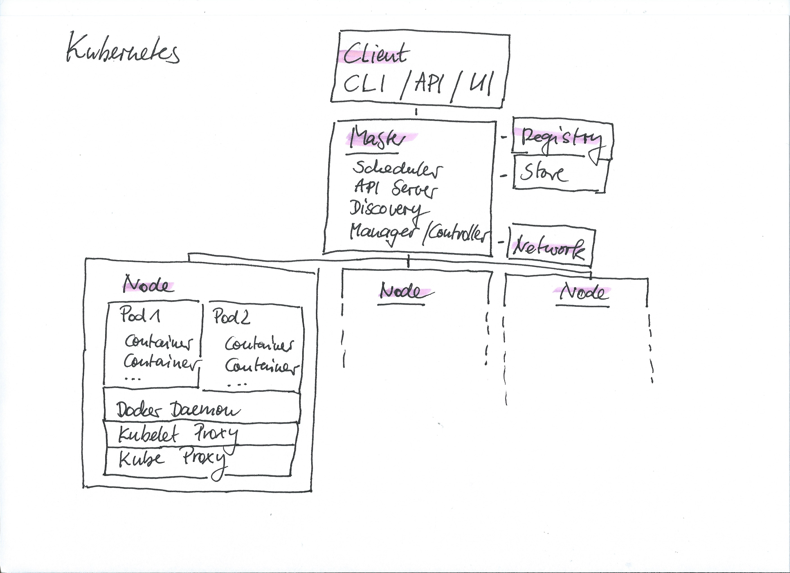
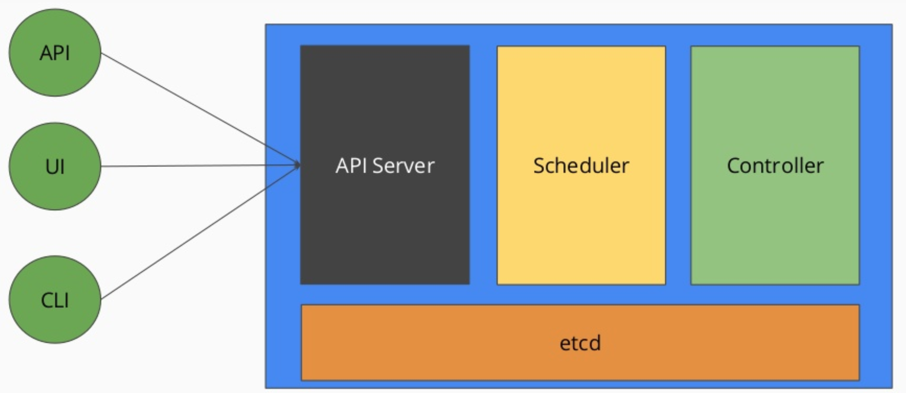
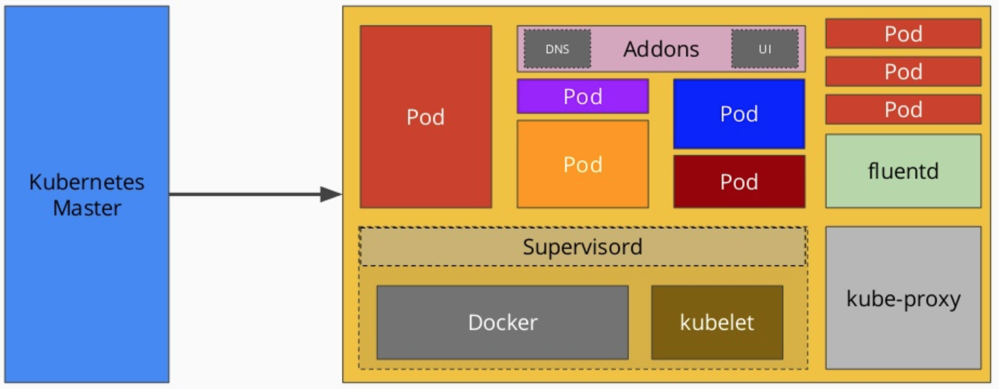
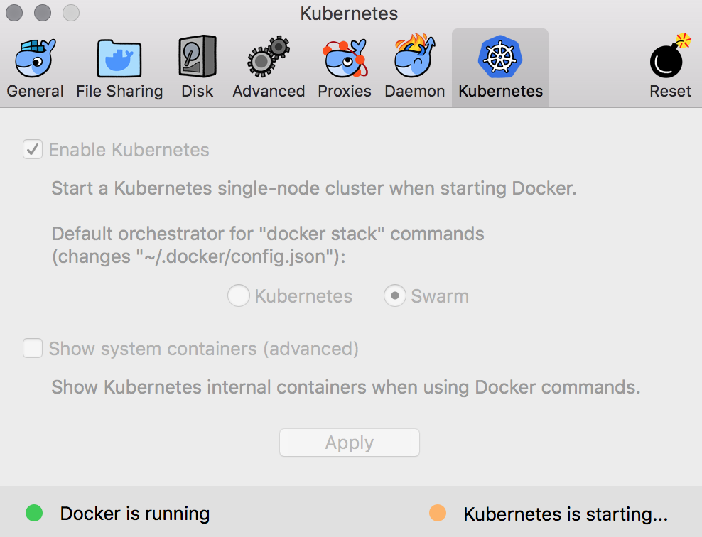

# Concepts & Architecture

- [Components](#components)
- [Setup](#setup)
- [Docker Containers](https://github.com/MikeBild/introduction-docker)



## Components

### Master Node



- Kube-API-Server - Remote API
- Kube-DNS - Service Discovery via DNS
- Kube-Controller-Manager - Controller to manage replication, endpoints, accounts and tokens
- Kube-Scheduler - Function for policy-rich, topology-aware, workload-specific function that figures out the best place for a new pod
- etcd - Distributed key-value store
- Kloud-Controller-Manager - Controller to manage 3rd-party addons, nodes, volumnes, routes and services

## Worker Node



- Pods - Deployment Unit
- Containers - Containers per Pod
- Kubelet-Agent - Worker-Agent
- Kube-Proxy - Workload, Traffic, DNS Proxy

## Setup

### Windows / OS-X



### OS-X Homebrew

```bash
brew update && brew install kubectl && brew cask install docker minikube virtualbox
```
