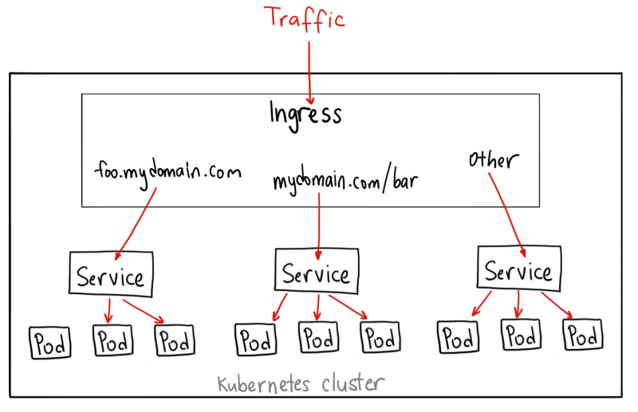

# Ingress

- sits in front of multiple services
- act as a “smart router”
- entrypoint into your cluster



## Types

### Single Service

```yaml
apiVersion: extensions/v1beta1
kind: Ingress
metadata:
  name: basic-ingress
spec:
  backend:
    serviceName: web
    servicePort: 8080
```

### Simple fanout

### Name based virtual hosting

### TLS

### Loadbalancing
