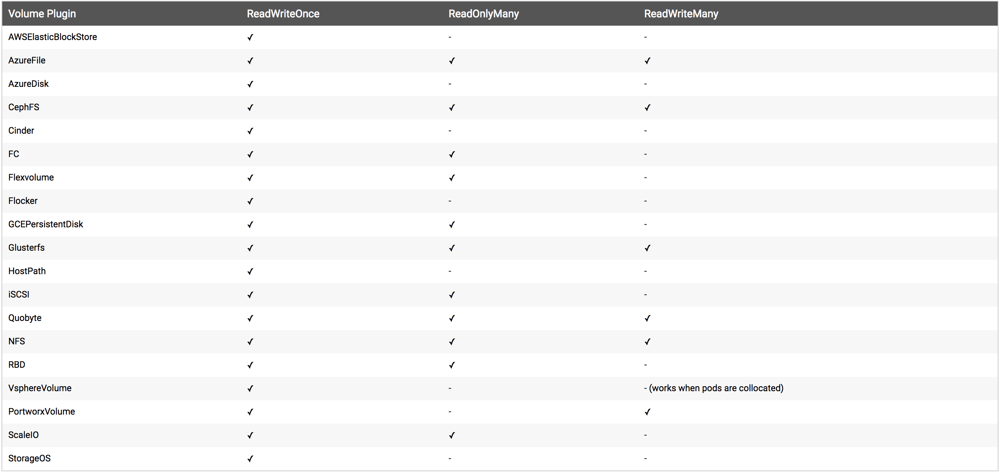

# Store States

- [Persistent Disks](#persistent-disks)
- [Persistent Volume Claim](#persistent-volume-claim)
- [Usage of PVC](#usage-of-pvc)
- [Examples](#examples)

## Examples

- [Files-App](examples/files-app/README.md)
- [Database-App](examples/database-app/README.md)

## Persistent Disks



## Persistent Volume Claim

`kubectl apply -f persistent-volume-claim.yaml`

_`persistent-volume-claim.yaml`_

```yaml
apiVersion: v1
kind: PersistentVolumeClaim
metadata:
  name: files-persistent-volume-claim
spec:
  accessModes:
    - ReadWriteOnce
  resources:
    requests:
      storage: 10M
```

## Usage of PVC

`kubectl apply -f deployment.yaml`

_`deployment.yaml`_

```yaml
apiVersion: extensions/v1beta1
kind: Deployment
metadata:
  name: files-app
  labels:
    app: files
    tier: frontend
spec:
  template:
    metadata:
      labels:
        app: files
        tier: frontend
    spec:
      containers:
        - image: gcr.io/workshops-mikebild/files-app:v1.1.0
          name: files-app
          ports:
            - containerPort: 8080
          env:
            - name: PORT
              value: '8080'
          volumeMounts:
            - name: files-persistent-storage
              mountPath: /app/files
      volumes:
        - name: files-persistent-storage
          persistentVolumeClaim:
            claimName: files-persistent-volume-claim
```
