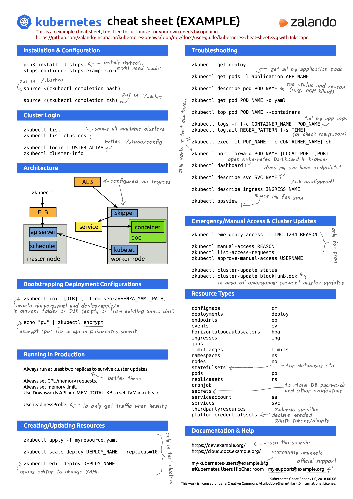

# CLI `kubectl`

- [Cheat Sheet](#cheat-sheet)
- [Context and Configuration](#context-and-configuration)
- [Creating Objects](#creating-objects)
- [Viewing, Finding Resources](#viewing-finding-resources)
- [Updating Resources](#updating-resources)
- [Scaling Resources](#scaling-resources)
- [Deleting Resources](#deleting-resources)
- [Interacting with Pods](#interacting-with-pods)
- [Interacting with Nodes and Cluster](#interacting-with-nodes-and-cluster)

## Context and Configuration

```bash
kubectl config view                                              # Show merged kubeconfig settings
kubectl config current-context                                   # Display the current-context
kubectl config set-context ...                                   # Set a context utilizing a specific username and namespace
```

## Creating Objects

```bash
kubectl create -f ./my-manifest.yaml                             # Create resource(s)
kubectl create -f ./my1.yaml -f ./my2.yaml                       # Create from multiple files
kubectl create -f ./dir                                          # Create resource(s) in all manifest files in dir
kubectl create -f https://git.io/vPieo                           # Create resource(s) from url

kubectl run nginx --image=nginx                                  # Start a single instance of nginx
```

## Viewing, Finding Resources

```bash
kubectl get services,pods,deployments                            # List all services, pods, deployments in the namespace
kubectl get nodes                                                # Get nodes
```

## Updating Resources

```bash
kubectl rolling-update frontend-v1 -f frontend-v2.json           # Rolling update pods of frontend-v1
kubectl label pods my-pod new-label=awesome                      # Add a Label
kubectl annotate pods my-pod icon-url=http://goo.gl/XXBTWq       # Add an annotation
```

## Scaling Resources

```bash
kubectl scale --replicas=3 rs/foo                                 # Scale a replicaset named 'foo' to 3
kubectl scale --replicas=3 -f foo.yaml                            # Scale a resource specified in "foo.yaml" to 3
kubectl autoscale deployment foo --min=2 --max=10                 # Auto scale a deployment "foo"
```

## Deleting Resources

```bash
kubectl delete -f ./pod.json                                      # Delete a pod using the type and name specified in pod.json
kubectl delete pod,service baz foo                                # Delete pods and services with same names "baz" and "foo"
kubectl delete pods,services -l name=myLabel                      # Delete pods and services with label name=myLabel
kubectl delete po,svc --all                                       # Delete all pods and services, including uninitialized ones
```

## Interacting with Pods

```bash
kubectl logs my-pod                                               # Dump pod logs (stdout)
kubectl logs -f my-pod                                            # Stream pod logs (stdout)
kubectl run -i --tty busybox --image=busybox -- sh                # Run pod as interactive shell
kubectl attach my-pod -i                                          # Attach to Running Container
kubectl exec my-pod -- ls /                                       # Run command in existing pod (1 container case)
kubectl exec my-pod -c my-container -- ls /                       # Run command in existing pod (multi-container case)
kubectl top pod POD_NAME --containers                             # Show metrics for a given pod and its containers
```

## Interacting with Nodes and Cluster

```bash
kubectl cordon my-node                                             # Mark my-node as unschedulable
kubectl drain my-node                                              # Drain my-node in preparation for maintenance
kubectl uncordon my-node                                           # Mark my-node as schedulable
kubectl top node my-node                                           # Show metrics for a given node
kubectl cluster-info                                               # Display addresses of the master and services
```

## Cheat Sheet


