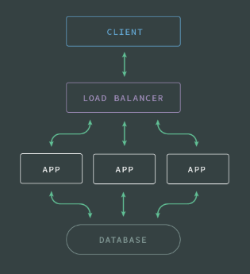
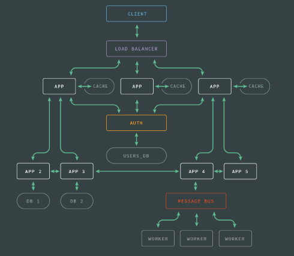

# Orchestration

- [Simple Environment](#simple-environment)
- [Complex Environment](#complex-environment)

## Simple Environment

- Multiple Services

## Complex Environment

- Complex Service Dependencies
- Multiple Environments (Testing, Staging, Production)

