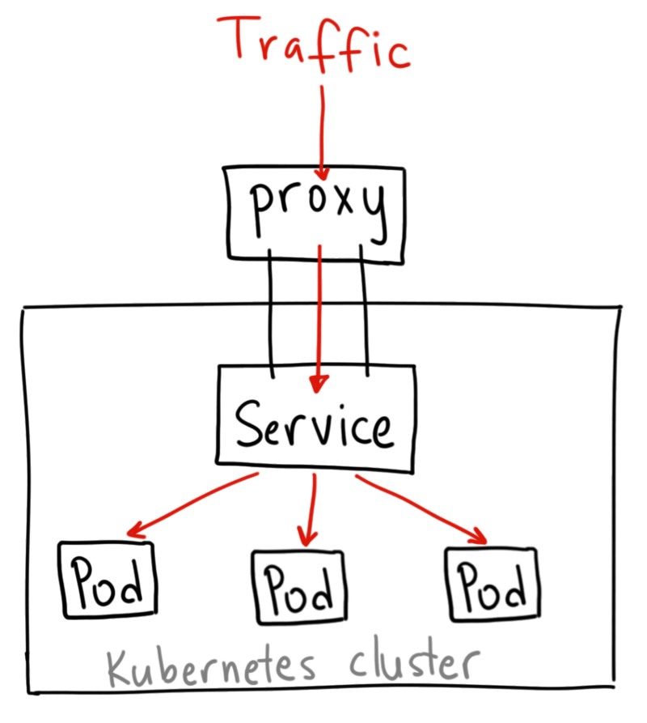
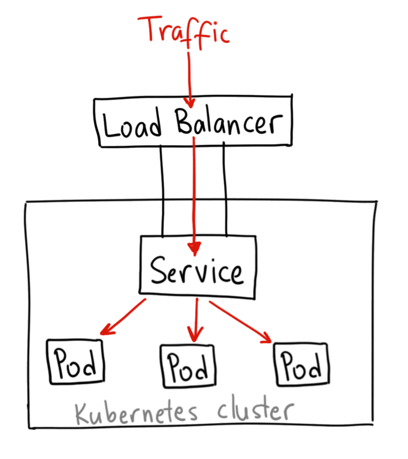

# Services

- Abstraction over Deployments
- Expose via network ports or load-balancer
- Service Discovery via DNS
- DNS Annotations for external DNS

- [Service](#service)
- [Types](#types)
  - [NodePort](#NodePort)
  - [LoadBalancer](#loadbalancer)
- [Monitoring & Health-Checks](#monitoring-and-health-checks)
  - [Liveness Probe](#liveness-probe)
  - [Readiness Probe](#readiness-probe)
  - [Init-Container](#init-container)



## Service

`kubectl apply -f service.yaml

_`service.yaml`_

```yaml
apiVersion: v1
kind: Service
metadata:
  name: my-service
  labels:
    app: app
    tier: frontend
  annotations:
    external-dns.alpha.kubernetes.io/hostname: my-service.workshops.mikebild.com.
spec:
  selector:
    app: app
    tier: frontend
  type: LoadBalancer
  ports:
    - port: 80
      targetPort: 8080
```

## Types

### NodePort


### LoadBalancer



## Monitoring and Health-Checks

- [Reference](https://kubernetes.io/docs/tasks/configure-pod-container/configure-liveness-readiness-probes/)

### Liveness Probe

```yaml
spec:
  containers:
    - name: liveness
      image: k8s.gcr.io/busybox
      livenessProbe:
        httpGet:
          path: /healthz
          port: 8080
          httpHeaders:
            - name: X-Custom-Header
              value: Awesome
        initialDelaySeconds: 3
        periodSeconds: 3
```

### Readiness Probe

```yaml
spec:
  containers:
    - name: readiness
      image: k8s.gcr.io/busybox
      readinessProbe:
        exec:
          command:
            - cat
            - /tmp/healthy
        initialDelaySeconds: 5
        periodSeconds: 5
```

### Init-Container

- [Reference](https://kubernetes.io/docs/concepts/workloads/pods/init-containers/)
